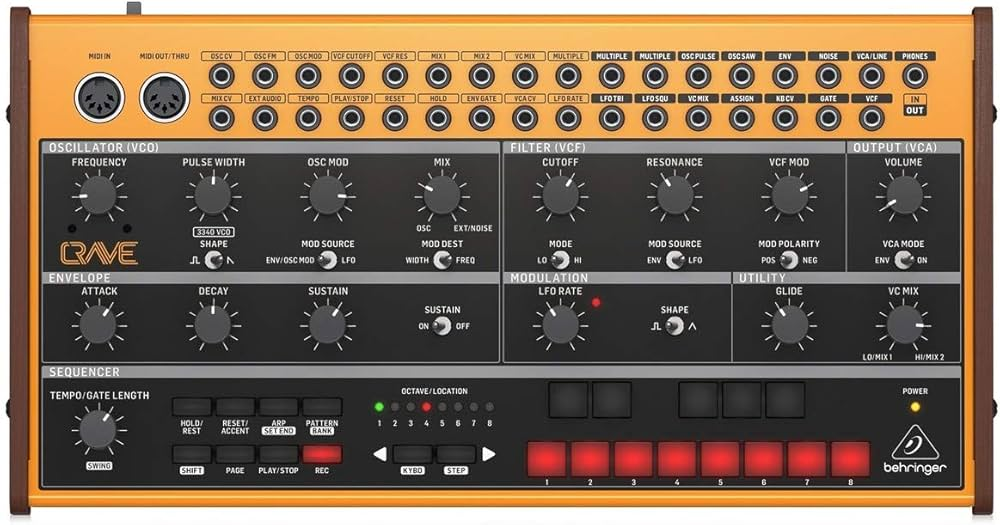

# Crave

{width=600}

**Manufacturer:** Behringer  
**Type:** Semi-Modular Analog Synthesizer  
**Power:** USB or DC 12V

[Download Manual](../manuals/crave.pdf)

---

## Overview

The Crave is a monophonic semi-modular analog synthesizer with a built-in 32-step sequencer and arpeggiator. It has 46 patch points and integrates directly with Eurorack at standard signal levels.

---

## Signal Path (Default)

```
VCO → LADDER FILTER → VCA → OUTPUT
         ↑
LFO / AHD ENVELOPE (internally normalled)
```

---

## Oscillator

Single VCO with:

| Waveform | Notes |
|----------|-------|
| Sawtooth | Primary waveform |
| Square | With PWM control |
| Triangle | Softer timbre |

---

## Filter

Moog-style 24dB/oct transistor ladder filter (low-pass only).

| Control | Function |
|---------|----------|
| CUTOFF | Filter frequency |
| RESONANCE | Self-oscillates at maximum |
| ENV AMOUNT | Envelope modulation depth into cutoff |

---

## Patch Points (selected)

| Jack | Direction | Notes |
|------|-----------|-------|
| VCO OUT | Out | Raw oscillator output |
| VCF IN | In | Audio input to filter |
| VCF OUT | Out | Filtered output |
| VCA IN | In | Audio input to VCA |
| VCA OUT | Out | Final audio output |
| ENV OUT | Out | AHD envelope CV |
| LFO OUT | Out | LFO CV |
| PITCH CV IN | In | 1V/oct pitch input |
| GATE IN | In | Gate input |
| MIDI IN | In | 3.5mm TRS MIDI (Type A) |
| CV/GATE OUT | Out | Sequencer/arp CV and gate output |

---

## Sequencer

- 32 steps, programmed in real time or step-by-step
- CV/GATE OUT sends sequencer output — use this to drive Eurorack modules from the Crave's sequencer
- Clock in/out for sync with other gear

---

## Notes

**Driving Eurorack from the sequencer:** Patch CV/GATE OUT into a Eurorack oscillator's V/OCT and envelope trigger inputs — the Crave becomes a standalone sequencer for your rack.

**Self-oscillation:** At maximum resonance the filter self-oscillates and tracks V/oct reasonably well via PITCH CV IN — usable as a second sine-wave voice.
