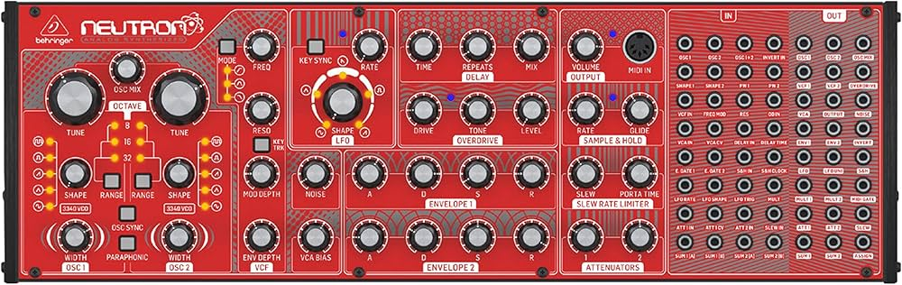
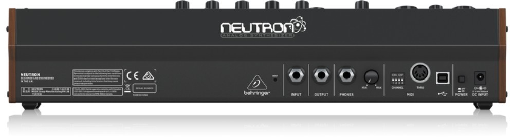
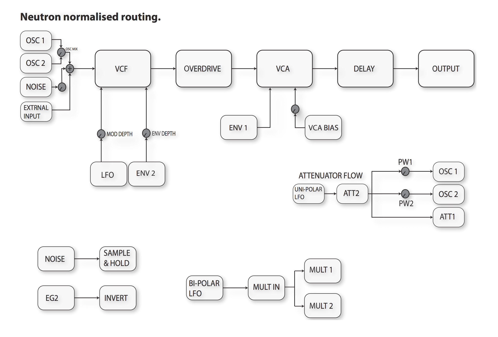

# Neutron

{width=900}
{width=900}

**Manufacturer:** Behringer  
**Type:** Semi-Modular Paraphonic Synthesizer  
**Power:** USB or DC 12V

[Download Manual](../manuals/neutron.pdf)

---

## Overview

The Neutron is a paraphonic semi-modular synthesizer with 56 patch points. It requires no patching to make sound — all modules are normalled internally — but the patch bay exposes every stage for Eurorack integration.

---

## Signal Path (Default)

---

## Oscillators

| Control | Function |
|---------|----------|
| RANGE | Octave selector (32', 16', 8', 4', 2') |
| TUNE | Coarse pitch |
| WAVEFORM | Saw, square/PWM, triangle, sine |
| PWM | Pulse width (when square selected) |

Both oscillators share the same controls but have independent TUNE knobs. OSC 2 can be detuned or used as an LFO.

---

## Filter

Steiner-Parker multimode filter — simultaneously outputs LP, BP, HP, and Notch from a single input.

| Jack | Notes |
|------|-------|
| FILTER IN | Patch external audio here to process through the filter |
| LP OUT | Low-pass output |
| BP OUT | Band-pass output |
| HP OUT | High-pass output |
| NOTCH OUT | Notch output |
| CUTOFF CV | External cutoff modulation |

---

## Patch Points (selected)

| Jack | Direction | Notes |
|------|-----------|-------|
| OSC 1/2 OUT | Out | Individual oscillator outputs |
| FILTER IN | In | Audio input to filter |
| EXT IN | In | External audio into mixer |
| ENV OUT | Out | Envelope CV output |
| LFO OUT | Out | LFO CV output |
| VCA IN | In | Bypass internal routing, feed VCA directly |
| MIDI IN | In | 3.5mm TRS MIDI (Type A) |

---

## Notes

**Eurorack integration:** The Neutron runs at Eurorack signal levels (+/-5V audio, 0–5V CV). Patch its ENV OUT or LFO OUT into modules directly, or send Eurorack CV into CUTOFF CV or OSC 1/2 inputs.

**Paraphony:** Both oscillators track the same MIDI pitch by default. In paraphonic mode, they play the last two notes held simultaneously through the shared filter.

**Bypass Overdrive:** The neutron signal path takes the VCF output into the overdrive before it feeds it into the VCA. Patch VCF1 output to VCA1 to bypass the overdrive.