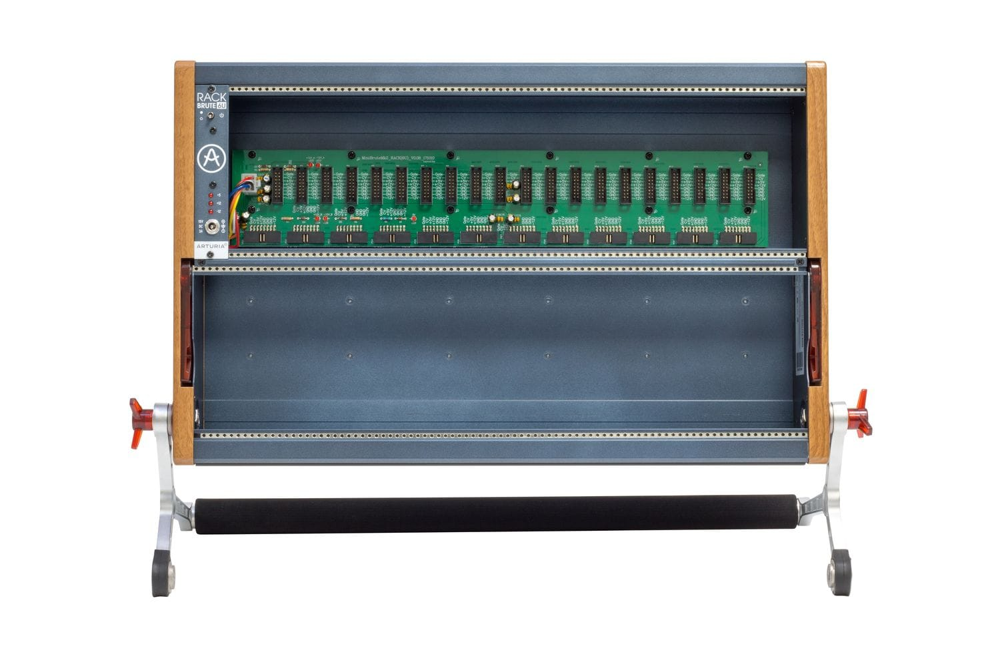

# RackBrute 6U

**Manufacturer:** Arturia  
**Type:** Eurorack Case  
**Power:** Meanwell external PSU (included)

[Download Manual](../manuals/rackbrute-6u.pdf)

---

## Specifications

| Spec | Value |
|------|-------|
| Rows | 2 |
| HP per row | 88 HP |
| Total HP | 176 HP |
| Row depth | 64mm |
| +12V bus | 3000 mA |
| -12V bus | 1000 mA |
| +5V bus | 500 mA |

---

## Bus

Each row has its own bus board. The bus carries +12V, -12V, +5V, CV (pitch), and Gate lines. The power module ([RackBrute 6U Power](../modules/rackbrute-power.md)) occupies 5HP in the top row.

---

## Notes

**Mounting angle:** The RackBrute 6U can be used flat on a desk or folded to a playing angle using the kickstand. It also mounts in a standard 19" rack with optional brackets.

**Power budget:** Track current draw against the 3000mA / 1000mA rails in the [Inventory](../inventory.md). The -12V rail is the more constrained one — filters and VCAs often draw more from -12V.

**Linking cases:** Multiple RackBrutes can be connected with a link cable that shares the CV/Gate bus lines between cases.
