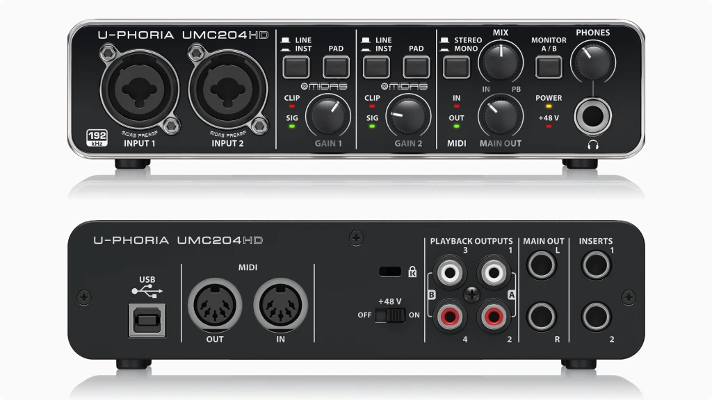

# UMC204HD

**Manufacturer:** Behringer  
**Type:** USB Audio Interface  
**Power:** USB bus powered

[Download Manual](../manuals/umc204hd.pdf)

---

## Overview

2-in / 4-out USB 2.0 audio interface with MIDAS-designed preamps, 24-bit/192kHz resolution, and hardware zero-latency monitoring.

---

## Inputs

| Input | Type | Notes |
|-------|------|-------|
| IN 1 | Combo XLR / TRS | MIDAS mic pre, phantom power switchable |
| IN 2 | Combo XLR / TRS | MIDAS mic pre, phantom power switchable |
| INST switch | — | Switches IN 1 to high-impedance for direct guitar/bass |

---

## Outputs

| Output | Type | Notes |
|--------|------|-------|
| MAIN OUT L/R | TRS 6.35mm | Main stereo output |
| OUT 3/4 | TRS 6.35mm | Secondary stereo output |
| HEADPHONE 1 | 6.35mm TRS | With independent level knob |
| HEADPHONE 2 | 6.35mm TRS | With independent level knob |

---

## MIDI

| Port | Notes |
|------|-------|
| MIDI IN | 5-pin DIN |
| MIDI OUT | 5-pin DIN |

---

## Notes

**Phantom power:** The +48V switch applies to both XLR inputs simultaneously — not individually. Avoid engaging it with ribbon mics or dynamic mics that may be damaged.

**Direct monitoring:** The MONITOR MIX knob blends USB playback and live input with zero latency. Fully clockwise = input only (useful for tracking with DAW playback separately controlled).

**Eurorack levels:** Modular audio is typically at +/-5V (≈ +16dBu). The UMC204HD inputs clip around +8dBu (instrument level). Use an attenuator or the PAD switch before sending modular directly into the interface.
