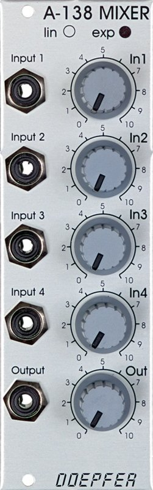

# Doepfer A-138-B Mixer (Logarithmic)

{height=600}

**Manufacturer:** Doepfer
**Type:** Logarithmic Mixer
**HP:** 8 | **Depth:** 35mm  
**Power:** +12V 10mA / -12V 10mA

[Download Manual](../manuals/a138b.pdf)

---

## Overview

Module A-138 is a four channel mixer, which can be used with either control voltages or audio signals. Each of the four inputs has an attenuator, and there's a master attenuator, so that the mixer can be used at the end of the audio chain - ie. it can be used to interface directly with an external mixer, amplifier, etc.
