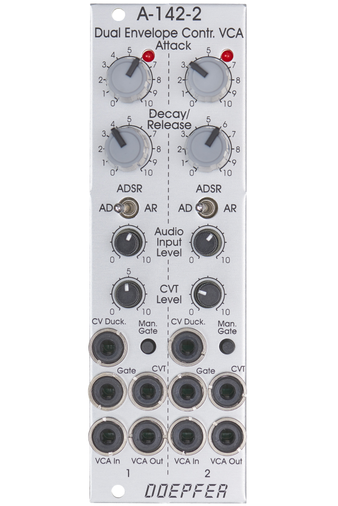

# Doepfer A-142-2 Dual Envelope Controlled VCA

{height=600}

**Manufacturer:** Doepfer
**Type:** Envelope Generator + VCA
**HP:** 8 | **Depth:** 45mm
**Power:** +12V 60mA / -12V 60mA

---

[Download Manual](https://doepfer.de/a1422.htm)

## Overview

The A-142-2 packs two complete envelope-controlled VCAs behind an 8 HP panel. Each sub-unit pairs an envelope generator (with exponential curve shapes) with a linear VCA — essentially a full "gate in, shaped audio out" voice channel. Envelope times range from about 1 ms to 30 seconds, and each channel has a manual gate button for testing without a patch cable.

---

## Envelope Modes

A toggle switch per channel selects the envelope type:

| Mode | Behaviour |
|------|-----------|
| AD | Attack–Decay: full cycle runs on a trigger, regardless of gate length |
| AR | Attack–Release: rises while the gate is high, falls when it goes low |
| ADSR | Attack–Decay–Sustain–Release with a fixed 50% sustain level; Decay and Release share one time control |

---

## Controls Per Channel

| Control | Function |
|---------|----------|
| A | Attack time (~500µs to several minutes) |
| D/R | Decay/Release time (~500µs to several minutes) |
| Mode switch | AD / AR / ADSR selection |
| Audio level | Attenuator for the audio input |
| CVT level | Attenuator for the time control voltage input |
| Gate button | Manual gate for testing |

---

## Inputs & Outputs (Per Channel)

| Jack | Signal | Notes |
|------|--------|-------|
| Gate | Gate/Trig | Needs at least +5V to trigger |
| CVT | CV | Voltage control of envelope time(s) — which parameter it affects is set by jumpers |
| CV Ducking | CV | Mutes the VCA: full muting above ~+5V, partial in the 0–5V range |
| Audio IN | Audio | Signal to be shaped, with input attenuator |
| Audio OUT | Audio | Envelope-shaped output |

---

## Jumper Configuration

Internal jumpers configure behaviour without patching:

- **CVT routing:** Choose whether the CVT input controls Attack, Decay/Release, or both — and in which direction
- **Gate normalling:** Gate input 1 can optionally trigger both envelope generators
- **Bus gate:** Each envelope can pick up the gate signal from the system bus
- **Envelope access:** A pin header exposes the raw envelope signal and the VCA's CV input (factory-jumpered together)

---

## Patching Notes

**Instant voice channel:** Oscillator into Audio IN, gate from a sequencer into Gate — you get a plucked or sustained voice with no separate envelope and VCA to patch. Two channels means two voices in 8 HP.

**Ducking:** Patch a gate or envelope from a rhythm source into CV Ducking to push a pad or drone out of the way whenever a drum voice fires — sidechain-style pumping without a compressor.

**Voltage-controlled decay:** Route the CVT input to Decay/Release via the jumper, then modulate it with a sequencer or random source so each note gets a different pluck length.
