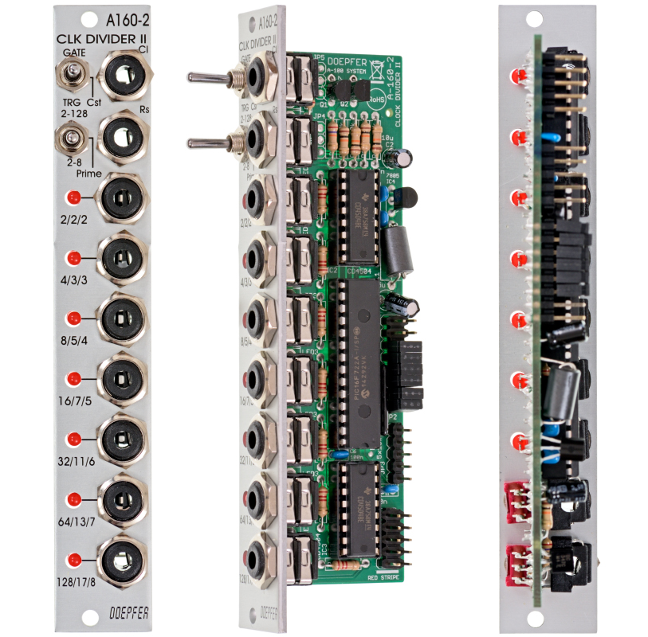

# Doepfer A-160-2 Clock/Trigger Divider

{height=600}

**Manufacturer:** Doepfer  
**Type:** Clock Divider  
**HP:** 4 | **Depth:** 30mm  
**Power:** +12V 30mA / -12V 0mA

---

[Download Manual](https://doepfer.de/a1602.htm)

## Overview

The A-160-2 is a clock and trigger divider. A clock or trigger signal patched into CLK IN is divided simultaneously across eight outputs, each at a different division ratio (/2 through /256). A reset input returns all outputs to their initial state, useful for locking divisions back into sync at the start of a phrase.

---

## Division Sets

A front-panel switch selects which set of ratios the eight outputs use:

| Switch Position | Divisions |
|----------------|-----------|
| Powers of two | /2, /4, /8, /16, /32, /64, /128 |
| Prime numbers | /2, /3, /5, /7, /11, /13, /17 |
| Integer | /2, /3, /4, /5, /6, /7, /8 |

---

## Output Mode

A second toggle switches between two output behaviours:

| Mode | Behaviour |
|------|-----------|
| Gate | Outputs act as standard binary dividers — each output is high for half its period |
| Trigger | Outputs are AND-wired with the clock signal, so pulse width is determined by the incoming clock |

A third position ("Cst") is reserved for custom firmware and is currently unimplemented.

---

## Inputs & Outputs

| Jack | Signal | Notes |
|------|--------|-------|
| CLK IN | Gate/Trig | Clock or trigger source to divide |
| RST IN | Gate/Trig | Resets all dividers to their starting state |
| /2–/256 (or prime/integer equivalent) | Gate/Trig | Eight simultaneous division outputs |

---

## Reset & Clock Configuration (Jumpers)

Onboard jumpers allow further configuration without a patch cable:

- **Clock edge:** Rising or falling edge sensitivity for CLK IN
- **Reset type:** Level-triggered or edge-triggered
- **Reset polarity:** Positive (>2.5V / rising edge) or negative (<1V / falling edge)
- **Output polarity:** Standard or inverted

---

## Patching Notes

**Rhythmic subdivision:** Patch your master clock into CLK IN, then take outputs at different divisions to trigger envelopes, step sequencers, or sample-and-hold modules at different rates.

**Polyrhythm:** Switch to the Integer or Prime division set to get non-binary rhythms — /3 against /4, or /5 against /7 create interesting polyrhythmic feels without an external sequencer.

**Sync:** Patch a reset trigger (e.g. from the start of a bar) into RST IN to re-align all divisions at the top of a phrase — essential when using Cellz or other sequencers that need to stay in step.
