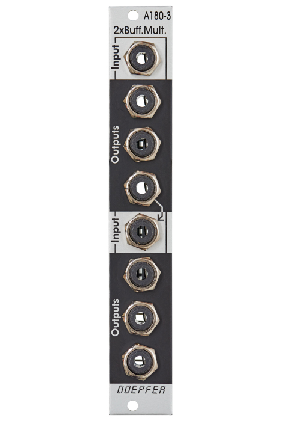

# Doepfer A-180-3 Buffered Multiple

{height=600}

**Manufacturer:** Doepfer  
**Type:** Buffered Multiple  
**HP:** 4 | **Depth:** 25mm  
**Power:** +12V 20mA / -12V 20mA

---

[Download Manual](https://doepfer.de/a1803.htm)

---

## Overview

The A-180-3 is a dual buffered 1-in-3 multiple. Each section takes one input and distributes it to three independently buffered outputs. Unlike passive multiples, buffered outputs prevent voltage drop when splitting CV signals — essential for pitch (V/OCT) distribution.

The two sections are normalled: if nothing is patched into the lower input, it receives the signal from the lower output of the upper section, making the module behave as a single 1-in-6 multiple.

---

## Inputs & Outputs

| Jack | Notes |
|------|-------|
| Upper IN | Input for the upper section |
| Upper OUT 1–3 | Three buffered copies of the upper input |
| Lower IN | Input for the lower section (normalled from upper section if unpatched) |
| Lower OUT 1–3 | Three buffered copies of the lower input |

---

## Configuration (Jumpers)

From version 3 onward, onboard jumpers allow the module to access the A-100 bus:

- **Bus CV/Gate transmit:** Send the input signal onto the A-100 bus for other bus-capable modules to receive
- **Bus CV/Gate receive:** Receive CV or Gate from the bus instead of a front-panel patch

!!! warning
    Jumpers ship in parking positions (bus access disabled). Only one module should transmit a given bus signal at a time — simultaneous transmitters will short circuit and may damage modules.

---

## Patching Notes

**V/OCT distribution:** Patch your keyboard or sequencer CV into the upper IN and take copies to multiple oscillators. Use the lower section for gate distribution in the same way.

**1-in-6 mode:** Leave the lower IN unpatched — the upper signal flows through to the lower section automatically, giving six buffered copies from a single source.
