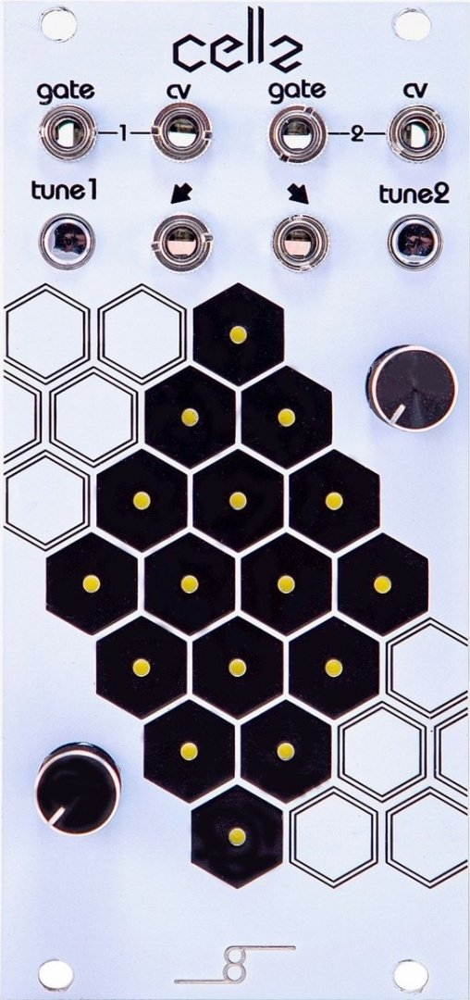

# Cellz

{width=300}

**Manufacturer:** Cre8audio  
**Type:** Sequencer — CV Touch Pad  
**HP:** 12 | **Depth:** 30mm  
**Power:** +12V 80mA / -12V 5mA

[Download Manual](../manuals/cellz.pdf)

---

## Overview

Cellz is a 16-pad capacitive touch controller arranged in a 4×4 grid. Each pad outputs a programmable CV and gate, making it usable as a step sequencer, performance pad, or quantized keyboard.

---

## Inputs & Outputs

| Jack | Signal | Notes |
|------|--------|-------|
| CLK IN | Gate/Trig | Advances step in sequencer mode |
| RESET | Gate/Trig | Resets sequence to step 1 |
| CV OUT | 0–5V CV | Quantized pitch or programmed value |
| GATE OUT | Gate | High when pad is active |
| CLK OUT | Gate | Divided/multiplied clock output |

---

## Modes

| Mode | Behaviour |
|------|-----------|
| Play | Touch pads output CV/gate directly (keyboard style) |
| Sequencer | Steps through programmed pads on clock input |
| Arpeggio | Arpeggiate held pads on clock input |

---

## Patching Notes

**As a keyboard:** Leave CLK IN unpatched, touch pads to output CV and gate directly — use CV OUT → V/OCT and GATE OUT → trigger input of envelope.

**As a step sequencer:** Patch a clock source into CLK IN. Program steps by holding REC and touching pads. Each pad stores a CV value.
