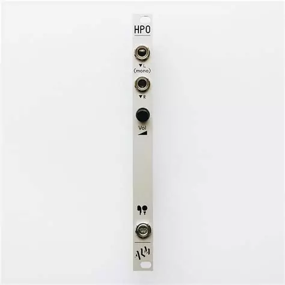

# ALM Busy Circuits HPO Headphone Output

{height=600}

**Manufacturer:** ALM Busy Circuits
**Type:** Headphone Output
**HP:** 2 | **Depth:** 38mm
**Power:** +12V 5mA / -12V 5mA

---

[Product Page](https://busycircuits.com/pages/alm019)

## Overview

The HPO (ALM019) is a no-frills stereo headphone amplifier in a super-slim 2 HP, skiff-friendly package. Patch a signal in, plug headphones into the 3.5mm stereo jack, and set the level with the single volume knob. It is low noise and good sounding — a simple way to monitor a patch privately without tying up the main outputs.

---

## Inputs & Outputs

| Jack | Signal | Notes |
|------|--------|-------|
| IN L | Audio | Left channel input; doubles to both ears when nothing is patched into IN R |
| IN R | Audio | Right channel input for stereo sources |
| PHONES | Stereo audio | 3.5mm stereo headphone output, level set by the volume knob |

---

## Patching Notes

**Mono monitoring:** Patch a mono signal into the left input only and it is doubled up into both sides of the headphones — no stereo source or extra mult needed.

**Cueing:** Take a parallel copy of a voice (e.g. via the A-180-3 buffered multiple) into the HPO to audition or tune it in headphones while the main mix keeps running to the speakers.

**End of chain:** Sit it after the A-138b mixer output to monitor the whole system on headphones — useful for late-night patching without an audio interface or speakers.
