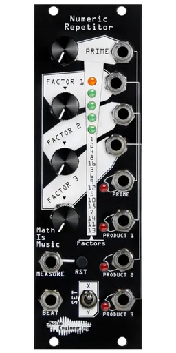

# Noise Engineering Numeric Repetitor

{width=300}

**Manufacturer:** Noise Engineering  
**Type:** Rhythmic Gate Generator / Clock Multiplier  
**HP:** 8 | **Depth:** 20mm (0.8")  
**Power:** +12V 50mA / -12V 5mA

[Download Manual](https://manuals.noiseengineering.us/nr/)

---

## Overview

Numeric Repetitor generates rhythmic gate patterns by treating a core pattern as a binary number and multiplying it against another to produce related, "human-meaningful" variations. Onboard are 32 prime rhythms, curated from all possible 16-step patterns by filtering for beat distribution and gap heuristics. One Prime output plays the base rhythm; three Product outputs each apply a binary multiplication (with Factors 2 and 3 additionally masked against fixed bit patterns) to derive variations from it. Only a beat clock is required to run; a measure/reset input keeps everything locked to the downbeat.

---

## Inputs & Outputs

| Jack | Signal | Notes |
|------|--------|-------|
| BEAT | Gate/Trig (~2.5V threshold) | Clock input — advances the pattern one step per pulse |
| MEASURE | Gate/Trig | Reset — realigns all outputs to the start of the measure |
| PRIME CV | CV (~7V range) | Selects the base rhythm from the 32-pattern bank |
| FACTOR 1–3 CV | CV (~7V range) | Modulates each multiplier, varying its Product output |
| PRIME OUT | Gate (~9V) | The selected base rhythm |
| PRODUCT 1–3 OUT | Gate (~9V) | Base rhythm multiplied by Factor 1/2/3 (2 and 3 also AND-masked) |

---

## Controls

| Control | Function |
|---------|----------|
| PRIME knob | Selects the base rhythm/pattern |
| FACTOR 1–3 knobs | Set each output's multiplier, attenuating the corresponding CV input |
| SET switch | Selects the active pattern bank (indicated by an orange LED) |
| RST button | Held: pauses advancement. Released: resets time to the start of the measure |

---

## Patching Notes

**Simplest patch:** Send a master clock into BEAT and route each of the four gate outputs (Prime + Product 1–3) to a different percussion voice — instant related-but-varied rhythms across a kit without a full sequencer.

**Evolving variation:** Divide the beat clock by 64 (e.g. with a clock divider) and patch that into a Factor CV input — the corresponding Factor knob then sets how much that slow pulse nudges the output's rhythm over time.

**Sync with other sequencers:** Patch a reset/measure-start trigger into MEASURE to keep Numeric Repetitor's patterns locked to the downbeat alongside Cellz or other clocked sequencers.
