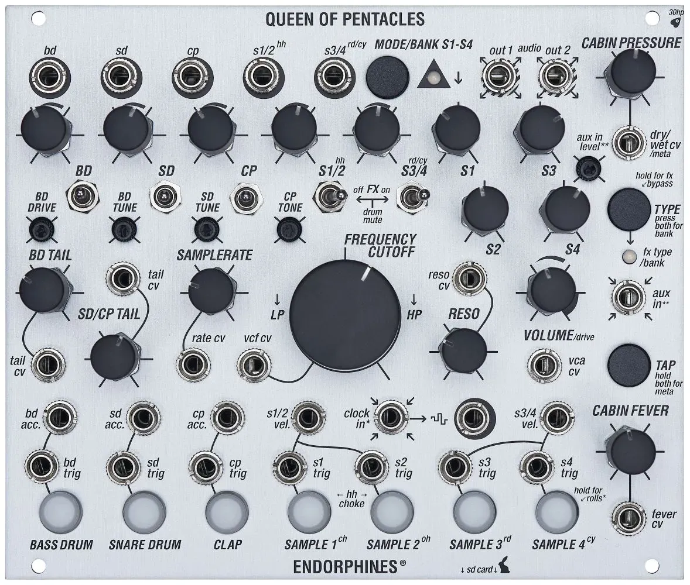

# Endorphin.es Queen of Pentacles

{width=600}

**Manufacturer:** Endorphin.es  
**Type:** Hybrid Analog/Sample Drum Voice + Effects  
**HP:** 30 | **Depth:** 26.5mm  
**Power:** +12V 350mA / -12V 90mA

[Download Manual](../manuals/queen-of-pentacles.pdf)

---

## Overview

Queen of Pentacles is a 7-voice hybrid drum module: three discrete analog drum circuits (bass drum, snare drum, hand clap) built around band-limited noise generators with spectrum animation, plus four sample-based voices (hi-hats, ride/crash, or user samples) played back at zero latency from a microSD card. A shared master filter (Throttle/Flaps), saturator, and an onboard dual-bank effects processor (16 effects total — ambient "Airways" and percussive "Darkwaves" banks) sit across the final stereo output.

---

## Inputs & Outputs

| Jack | Signal | Notes |
|------|--------|-------|
| CLOCK IN | Gate/Trig | Advances the manual launch buttons in sequence when clocked |
| BD / SD / CP TRIG | Gate/Trig | Triggers the analog bass drum, snare, and clap |
| S1–S4 TRIG | Gate/Trig | Triggers the four sample-based voices |
| BD / SD / CP ACC-VEL CV | CV 0–5V | Accent/velocity CV for the analog drums; also colors tone depending on voice |
| S1–S4 CHOKE CV | CV | Choke input for sample voices (e.g. closed/open hi-hat) |
| VCF CV IN | CV 0–5V | Modulates the master filter (Throttle/Flaps) |
| CABIN PRESSURE CV IN | CV -5–+5V | Modulates effect dry/wet amount |
| CABIN FEVER CV IN | CV | Modulates the secondary effect parameter (decay, feedback, etc., depends on effect) |
| AUX IN | Audio (stereo 3.5mm) | External audio returned through the effect processor and summed into the output |
| BD / SD / CP OUT | Audio | Individual analog drum outputs — patching removes that voice from the final mix |
| S1/2, S3/4 OUT | Audio | Grouped sample outputs — patching removes those voices from the final mix |
| OUT 1 / OUT 2 | Audio (stereo, 3.5mm) | Final balanced master outputs |

---

## Effects Banks

A single "type" button cycles through 8 effects per bank; "tap" selects the bank and drives tap-tempo/secondary parameters.

| # | Airways (ambient) | Darkwaves (percussive) |
|---|--------------------|-------------------------|
| 1 | Hall Reverb | Gated Reverb |
| 2 | Shimmer Reverb | Spring Reverb |
| 3 | Room Reverb | Reversed Reverb |
| 4 | Plate Reverb | Flanger |
| 5 | Spring Reverb | Ring Modulator |
| 6 | Ping-Pong Delay | Overdrive |
| 7 | Tape Echo | Peak Compressor |
| 8 | Chorus | Freezer/Looper |

The CABIN PRESSURE knob always sets dry/wet; CABIN FEVER sets a secondary, effect-dependent parameter (hold TAP >1s to toggle it).

---

## Patching Notes

**Removing a voice from the mix:** Each drum output (BD, SD, CP, S1/2, S3/4) is normalled into the final stereo bus. Patching a cable out of one pulls that voice out of OUT 1/2 so it can be processed or recorded separately.

**Sample banks:** Eight banks of four samples live on the microSD card, selected with a long (2s) press of the bank button — useful for switching kits between patches without re-patching triggers.

**Effects as sends:** Route external audio into AUX IN to run it through the onboard reverb/delay bank alongside the drums, rather than only using the processor on the internal voices.
