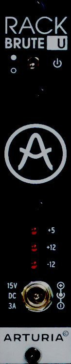

# RackBrute 6U Power

**Manufacturer:** Arturia  
**Type:** Power Supply Panel  
**HP:** 5 | **Depth:** 80mm  
**Power:** Provides power (see bus specs below)

[Download Manual](../manuals/rackbrute-6u.pdf)

---

## Bus Power

| Rail | Current |
|------|---------|
| +12V | 3000 mA |
| -12V | 1000 mA |
| +5V  | 500 mA  |

The power module connects to the Meanwell external brick PSU via a locking DIN connector. A green LED on the panel confirms bus power is live.

---

## Notes

**CV Bus:** The RackBrute bus carries +12V, -12V, +5V, Gate, and CV (pitch) lines. Not all modules use the CV/Gate bus lines — check individual module documentation.

**Inrush current:** Large systems with many capacitors can cause inrush current spikes at startup. If the supply trips on power-on, stagger module power using the switch rather than hot-patching.
